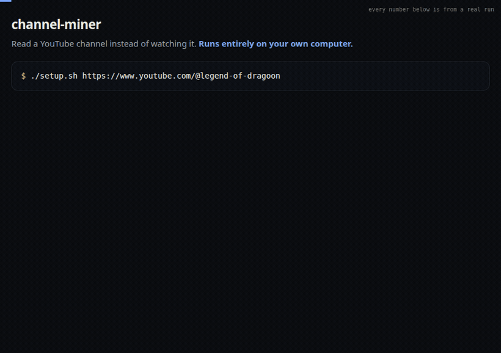

# channel-miner

**Read a YouTube channel instead of watching it.**

Point it at a channel. It collects every video, turns them all into text, and leaves you with
something you can search, grep, or read at your own pace — three hundred hours of video as a folder
of files.

If you also tell it what you already know, it goes further: an AI reads the lot and hands you a
short list of only the things that were new *to you*.

Everything runs on your own computer. No accounts, no API keys, nothing to pay.

<p align="center"><a href="https://anthonygozzini.github.io/channel-miner/demo.html"></a></p>

<p align="center"><a href="https://anthonygozzini.github.io/channel-miner/demo.html">See it run →</a></p>

## Start here

```bash
git clone https://github.com/<you>/channel-miner.git
cd channel-miner
./setup.sh https://www.youtube.com/@Fireship
./run.sh --no-read
```

The channel address is the only thing you supply. `setup.sh` installs what is missing and writes
your settings file; `run.sh` does the work. The first run on a big channel takes a while — it is
fetching the entire back catalogue. Every run after that only picks up what is new.

When it finishes you have a `data/` folder:

| | |
|---|---|
| `txt/` | every video as readable text, with timestamps |
| `vtt/` | the original captions, untouched |
| `index.csv` | one row per video: id, date, length, title |
| `segments.jsonl` | the same text cut into ~40-second pieces, for searching |

That is a complete, permanent, offline copy of everything said on that channel. Most people stop
here, and that is a perfectly good place to stop.

**What language?** Whatever the channel speaks. It is detected from the videos themselves on the
first run — you are not asked and there is nothing to set.

## Going further

Everything below is optional. Add it when you want it; skip it and the tool still does the above.

### Narrow it to the subjects you care about

Add `topics` to `config.json` and each segment gets tagged; only tagged segments are kept.

```json
"topics": {
  "pricing": "price|cost|billing",
  "ai": "\\bai\\b|llm|model"
}
```

The values are search patterns — `|` means "or", so `price|cost|billing` matches any of the three.
Leave `topics` out entirely and nothing is filtered: you keep every segment.

### Let it tell you what is new to you

This is what the tool is really for. It needs two things.

**First, a rubric** — a numbered list of what you already know, in `config.json`:

```json
"rubric_name": "what I already know about web development",
"rubric": "1 frameworks: a new framework is not news unless it changes how state is handled\n2 pricing: what things actually cost to run at small scale"
```

Every transcript gets read against that list, and only what the list does *not* cover is reported.
Write it honestly and the results are sharp; write it vaguely and you get noise. This one file
entry does more for the quality of the output than everything else combined.

**Second, an AI model on your machine.** The setup script can install it:

```bash
./setup.sh --with-ai https://www.youtube.com/@SomeChannel
```

That installs [Ollama](https://ollama.com) — a free program that runs AI models locally — starts
it, downloads a small model (`llama3.2:3b`, about 2 GB, once) and points your config at it. It sits
behind a flag on purpose: a couple of gigabytes should never start downloading by surprise.

Want better results? `ollama pull qwen3.5:9b` and set `"model": "qwen3.5:9b"` in `config.json`. It
needs about 7 GB of memory and reads noticeably better.

Ollama answers on `localhost:11434`. **`localhost` is your own computer** — that address goes
nowhere else. It is the reason no transcript, and nothing you write in your rubric, ever leaves
your machine.

With both in place, `./run.sh` produces `data/findings.md`:

```
# Findings — candidates from the automated reading pass

## dQw4w9WgXcQ · How we cut our AWS bill by 80%
- refine #4: they move cold data to object storage BEFORE compressing it, not after —
  "compress the small stuff, archive the big stuff, in that order or you pay twice"
- refine #2: their build cache is keyed on the lockfile hash, not the branch —
  "branches lie, lockfiles don't"
```

Each line points at one video, one idea, and the sentence the person actually said. Most videos
produce nothing at all — that is the correct outcome, and the whole point.

### Videos with no captions

Most channels have automatic captions and nothing more is needed. For the ones that don't,
`setup.sh` builds a local Whisper install that transcribes them on your machine. A four-hour video
takes about three minutes on a graphics card. Don't want it? `./setup.sh --no-stt <url>`.

## How it works

| Step | What happens | Needs AI? |
|---|---|---|
| 1. Fetch | Walks the channel and collects anything new, captions included | no |
| 2. Transcribe | Turns videos without captions into text | no |
| 3. Index | Cuts transcripts into ~40-second pieces, tags them by topic | no |
| 4. Find new concepts | Reports ideas that recur constantly but match none of your topics — the things you have no word for yet | no |
| 5. Read | A model reads each transcript against your rubric and proposes findings | yes |
| 6. Judge | A second pass rules on each: keep, watch, or discard — with a reason | yes |

Step 4 is worth knowing about: it uses no AI, only counting. If a channel keeps circling something
you never gave a name to, it surfaces there.

## What it costs

| | Needed for | Disk | Speed |
|---|---|---|---|
| The downloader | steps 1–3, always | ~50 MB | seconds per video |
| Whisper | step 2, only for videos without captions | 1.6 GB | a 4-hour video in ~3 minutes on a GPU |
| An AI model | steps 5–6 only | ~2 GB small, 6.6 GB better | 20–30 minutes for three videos |

`setup.sh` handles the first two, and the third with `--with-ai`.

The text itself is tiny: about 40 MB for 500 videos. Audio is deleted after each transcription.

**On speed.** A 9B model wants about 7 GB of memory. On a 4 GB graphics card it doesn't fit and
falls back to the processor, around 5 words per second — a minute per chunk, six to eight chunks
per video. A smaller model is far faster and usually fine, because step 6 checks its work anyway.

## Running it on a schedule

```
17 */4 * * * /path/to/channel-miner/run.sh >> /path/to/channel-miner/data/run.log 2>&1
```

Every step resumes where the last stopped, so a missed run costs nothing, and a lock file makes
overlapping runs impossible. If downloads start failing the run prints a warning — without it,
a broken downloader looks exactly like "nothing new this week".

## Settings

Everything lives in `config.json`, and every entry carries a note beside it. Only the first is
required:

- **`channel`** — the channel address. Nothing else has to be set.
- **`language`** — leave it out and it is detected from the channel. Set `"en"`, `"it"`, … to force it.
- **`topics`** — `{name: pattern}`. What gets tagged, and the baseline "new" is measured against.
- **`rubric`** — what you already know. The reading pass reports only what it doesn't cover.
- **`model`** — any Ollama model.
- **`stopwords`**, **`function_words`**, **`boilerplate`** — word lists with English defaults.
  Replace them to work in another language.

## Limits

- "New" here means *repeated*. Something brilliant said exactly once won't clear the bar.
- The reading pass is a small local model. It proposes; it doesn't decide.
- The first run on a channel with thousands of videos takes a long time.
- It reads what people say, not what they show on screen.

MIT licensed.
